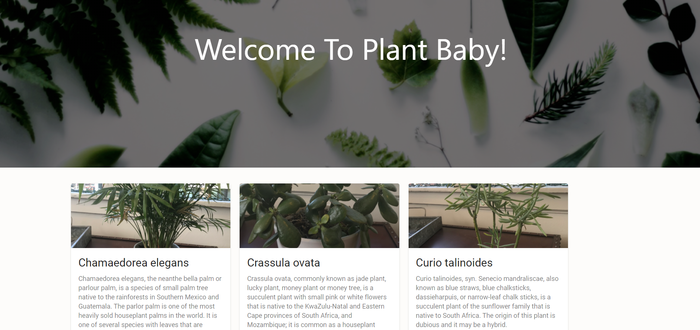
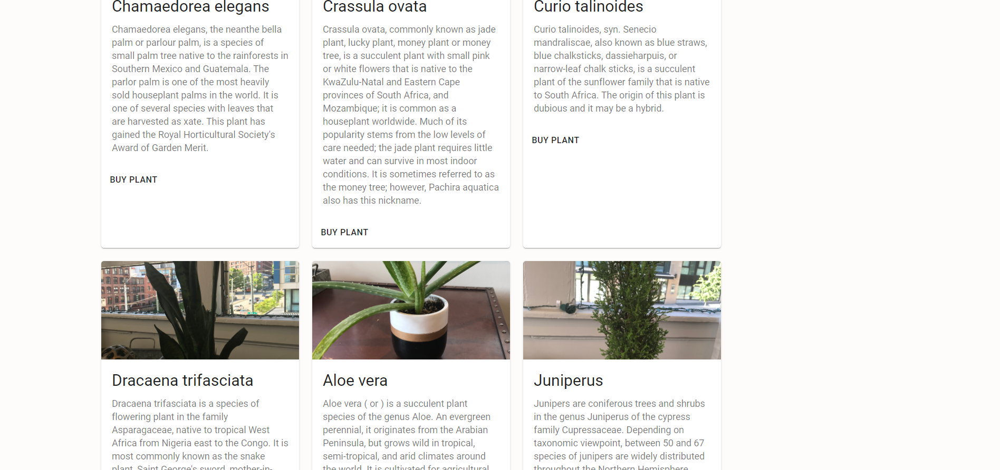
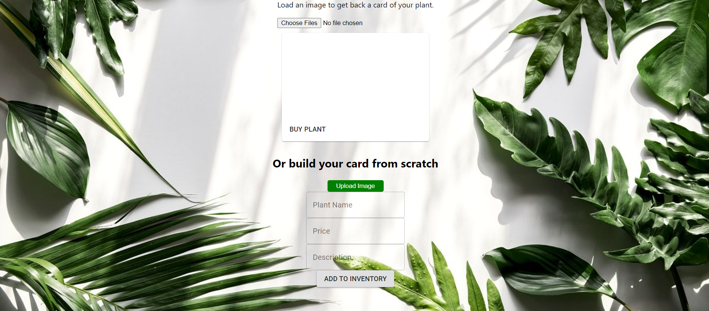
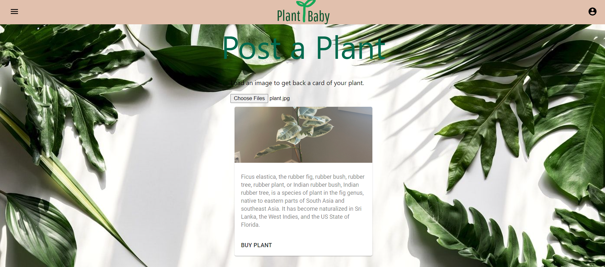

# Plant Baby

## Table of Contents
1. [Description](#description)
2. [Usage](#usage)
3. [Technologies](#technologies)
4. [Authors](#authors)
5. [Contributing](#contributing)
6. [License](#license)
7. [Questions](#questions)

## Description
A classified advertisement website devoted to indoor plants. If you're looking to browse check out the shop page and find your perfect plant. Post your plant up for sale in a few easy steps. To identify a plant, upload an image and let our app tell you in a matter of seconds.  

## Usage

[Click this link to check out our deployed application!](https://plantbaby.herokuapp.com/)

The landing page features a few of the most recently uploaded plants for sale. No sign-ups or logins required to start your plant search. 
* ### Landing page

Navigate to the shop page and browse the entire selection of plants.
* #### Shop page

Navigate to the post page where users easily build their plant advertisement.  Fill out the form then click "Add To Inventory" to have your plant posted to the shop. 
* #### Post page -  Build a plant ad 

Also on the post page, users are able to identify an unknown plant by uploading an image then promptly receiving a card with its common name, scientific name, and details of the plant. 
* #### Post page - Plant identification

## Technologies
Front End: 
ReactJS, Material UI, Axios

Back End: 
MySQL, Sequelize, bcrypt

APIs: 
* Machine learning plant identification

    

* For uploading images

    

## Authors
| Name | GitHub  |
| :--: | :-----: |
| Amanda Nguyen |  |
| Corey Moe |  |
| Rick Rocero |  |
| Kat Hunt |  |

## Contributing
This is the front end git repository. The back end is a separate git repository located at [Back End Repo](https://github.com/rickrocero/Plant-Baby-Backend). Fork both git repositories and contact the repository owner about pull requests. 

## License
No license provided for this software.

## Questions
For questions, contact [Rick](https://github.com/rickrocero) or email me at rickrocero@gmail.com.